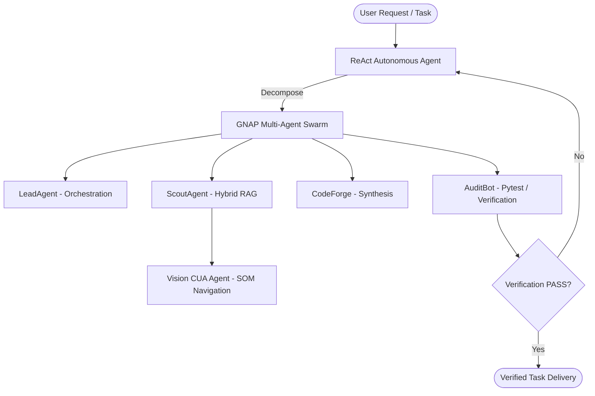

# Autonomous AI Agents & Intelligent Systems Workspace 🤖
### 🏫 Can Tho University (CTU) — College of Information & Communication Technology
**Student:** Dao Huu Trong (Đào Hữu Trọng) — **ID:** B2605840  
**Major:** Artificial Intelligence (*Cohort 52, 2026 – 2031*)  
**Architecture:** Multi-Agent Swarm (GNAP) • ReAct Reasoning • Vision CUA • Zero-Dependency Hybrid RAG

---

<p align="center">
  
  
  
  
  
</p>

---

## 📌 Architectural Overview

This repository houses the core autonomous intelligence and multi-agent protocols authored by **Dao Huu Trong** during coursework and research at Can Tho University. It delivers production-grade abstractions for deterministic reasoning, decentralized coordination, computer-use automation, and grounded retrieval.



---

## 🌟 Core Modules

| Module | Description | Key Capabilities |
| :--- | :--- | :--- |
| **`agents.react_agent`** | ReAct Reasoning Engine | Thought-Action-Observation loop, mathematical verification, loop-detection guards. |
| **`agents.gnap_swarm`** | Git-Native Agent Protocol | Role dispatch (Lead, Scout, Coder, Verifier), task boards, and auditable JSON handoffs. |
| **`agents.cua_vision`** | Computer-Use Vision Engine | Structured Object Model (SOM), bounding-box parsing, and synthetic UI interaction. |
| **`agents.hybrid_rag`** | Zero-Dependency Hybrid RAG | Dense TF-IDF + Keyword density matching with zero cloud database overhead. |

---

## 🚀 Quickstart Guide

### 1. Clone & Set Up
```bash
git clone https://github.com/DaoHuuTrong2404/autonomous-ai-agents-workspace.git
cd autonomous-ai-agents-workspace
```

### 2. Run the 10-Second Quickstart Demo
```bash
python3 examples/quickstart.py
```

### 3. Run Academic Paper Synthesis
```bash
python3 examples/academic_researcher.py
```

### 4. Execute Complete Test Suite
```bash
pip install pytest
pytest tests/ -v
```

---

## 🔬 Directory Structure
```text
autonomous-ai-agents-workspace/
├── .github/
│   └── workflows/
│       └── ci.yml               # GitHub Actions CI for Python 3.10-3.12
├── agents/
│   ├── __init__.py              # Unified package exports
│   ├── react_agent.py           # ReAct autonomous reasoning engine
│   ├── gnap_swarm.py            # Git-Native Agent Protocol swarm
│   ├── cua_vision.py            # Vision & SOM Desktop/Web automation
│   └── hybrid_rag.py            # High-performance lightweight RAG
├── examples/
│   ├── quickstart.py            # End-to-end runnable showcase
│   └── academic_researcher.py   # Paper analysis & citation generator
├── tests/
│   └── test_agents.py           # Unit tests across all agent architectures
└── README.md                    # Master documentation & specifications
```

---

## 👨‍💻 Maintainer & Academic Contact
- **Author:** Đào Hữu Trọng (Dao Huu Trong)
- **University:** Can Tho University (Đại học Cần Thơ - CTU)
- **Major:** Artificial Intelligence (Trí Tuệ Nhân Tạo)
- **Email:** [huutrong748@gmail.com](mailto:huutrong748@gmail.com)
- **Interactive 3D Portfolio:** [daohuutrong2404.github.io](https://daohuutrong2404.github.io)

---
*License: [MIT](LICENSE) © 2026 Dao Huu Trong. Built with precision for resilient intelligence.*